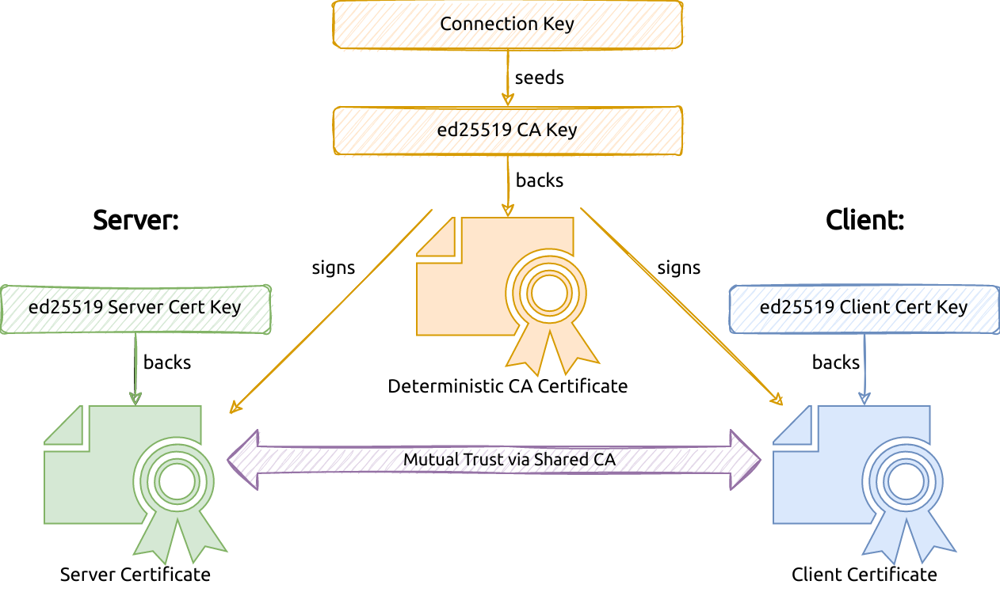

<p align="center">
  <h1 align="center"><b>kbtls</b></h1>
  <p align="center"><i><b>K</b>ey-<b>B</b>ased <b>TLS</b> - Mutually Trusted TLS Connections Based on a Pre-Shared Connection Key</i></p>
  <p align="center">
    <a href="https://github.com/RedTeamPentesting/kbtls/releases/latest"></a>
    <a href="https://pkg.go.dev/github.com/RedTeamPentesting/kbtls"></a>
    <a href="https://github.com/RedTeamPentesting/kbtls/actions?workflow=Check"></a>
    <a href="/LICENSE"></a>
    <a href="https://goreportcard.com/report/github.com/RedTeamPentesting/kbtls"></a>
  </p>
</p>

---

This library allows to create mutually trusted client and server certificates
based on a pre-shared connection key. This is possible because the pre-shared
connection key can be used on both sides to derive the same CA certificate which
is then used to sign the server and client certificates that are generated on
the spot.



---

**Warning:** This library is not meant for production use. It was developed to
be used in offensive security tools to conveniently provide an encrypted
connection ad-hoc without certificate management. While we are unaware of any
security risks with the library's approach, it uses TLS in an unconventional way
which may introduce subtle vulnerabilities. Please contact us if you are aware
of any security considerations regarding this library.

---

## Usage:

The following example shows how a connection key can be generated in order to
generate a listener:

```go
key, err := kbtls.GenerateConnectionKey()
// error handling
fmt.Println(key) // tvyFtKR0Y2IY/sN5EbxYscr15fGxa8Mx2NeelZUCpn0

listener, err := kbtls.Listen("tcp", "localhost:8443", key.String())
// error handling
```

In most cases, one endpoint generates and outputs the key like this. The user
then passes the generated key to the other endpoint where it can be used as
follows:

```go
key := "tvyFtKR0Y2IY/sN5EbxYscr15fGxa8Mx2NeelZUCpn0"
conn, err := kbtls.Dial("tcp", "localhost:8443", key)
// error handling
```

A full server and client example can be found
[here](https://github.com/RedTeamPentesting/kbtls/blob/main/examples/simple/main.go).
For custom listeners or for custom TLS configuration lower-level functions are
provided, as demonstrated
[here](https://github.com/RedTeamPentesting/kbtls/blob/main/examples/custom/main.go).
